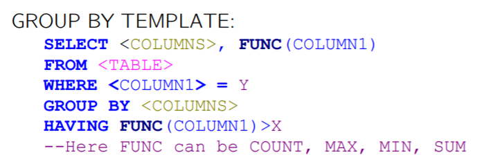
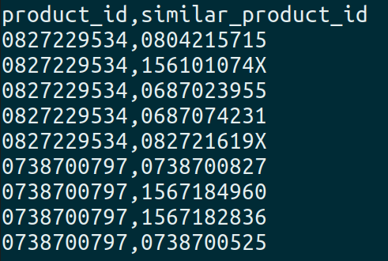
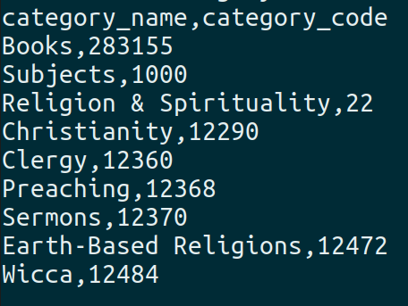
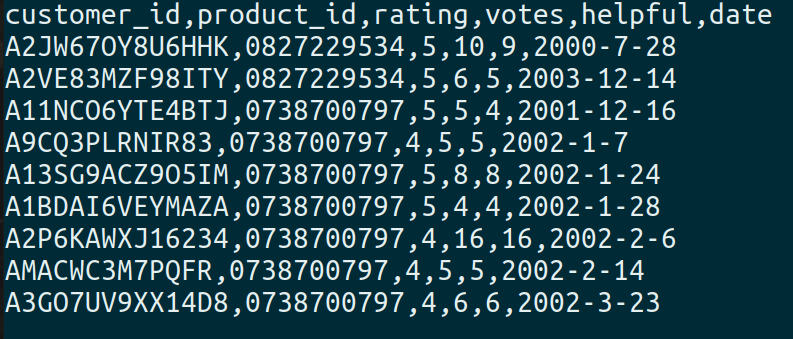

# Assignment #1

## Problem Statement

[link](Assignment-1)

## Query Format



## Input Data Format


## Approach

- converted given unstructured data into 4 tables named `product`, `similar`, `category`, and `review`, using a script which reads given file line by line and using regular expressions parse it and creates csv files. Read script [here](https://drive.google.com/file/d/1R0LYmtcHUwYjRnrTyAgvD_HthFcm4cHT/view?usp=sharing)
- Some entries from the tables
  - Product 
  - Similar 
  - Category 
  - Review 
- Then for hadoop program
  - SQL query is parsed and a json object is constructed out of it which is accessed by mapper and reducer
  - For query `select category_name, count(category_code) from category where category_name = 'Books' group by category_name having count(category_code) > 0`, JSON generated is 
  - The mapper uses this JSON to identify which rows satisfy WHERE condition, and it outputs all rows satisfying WHERE conditions as it is with key as the concatenation of values of columns present in group by clause
  - Then reducer calculates aggregate condition and checks if that collection of rows satisfy that aggregate condition or not, if they do, it outputs all columns present in selct clause and aggregate column value, else it ignores it.
- For Spark program
  - the query is parsed and SparkSQL is used to run the query

- Sample outputs of both programs for SQL query

```sql
    select category_name, count(category_code) from category where category_name = Books group by category_name having count(category_code) > 0
```

- Hadoop


```sql
    select category_name, count(category_code) from category where category_name = 'Books' group by category_name having count(category_code) > 0
```

- Spark


- Some Sample queries to try

```sql
select product_id, count(similar_product_id) from similar where product_id = 1559362022 group by product_id having count(similar_product_id) > 0
select category_name, count(category_code) from category where category_name = Books group by category_name having count(category_code) > 0
select asin, title, sum(downloaded) from product where asin = 0827229534 group by asin, title having sum(downloaded) > 0
select customer_id, max(rating) from review where customer_id = A2JW67OY8U6HHK group by customer_id having max(rating) > 0
```

## Instructions/Assumptions

- For Hadoop, do not enclose strings in `''`, but do it in spark
- Before running the job, delete `data/output` folder everytime

## Group Members

| Name                | ID            |
| ------------------- | ------------- |
| Harpinder Jot Singh | 2017A7PS0057P |
| Vishal Mittal       | 2017A7PS0080P |